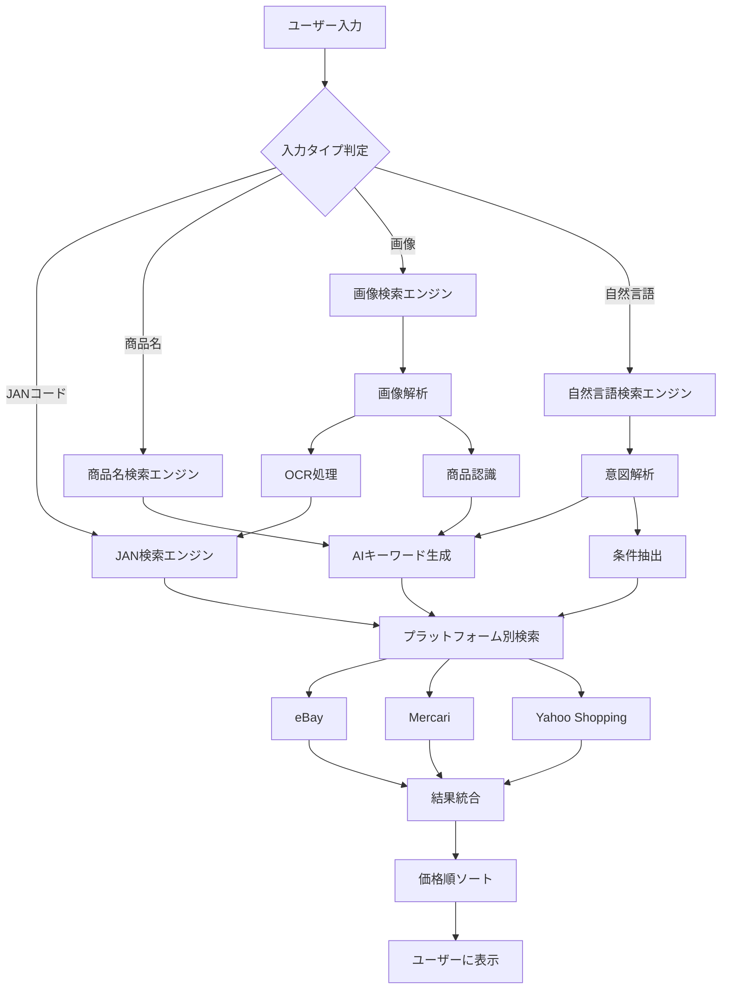

# 検索機能拡張計画

## 概要
現在のJANコード検索から、商品名検索、画像検索、自然言語検索へと機能を拡張します。

## フェーズ分けと実装計画

### Phase 1: 基盤整備（1週間）
**ブランチ**: `feature/search-foundation`

#### 1.1 検索インターフェースの統一
- 統一された検索リクエスト型の定義
- 検索タイプの列挙（JAN、商品名、画像、自然言語）
- APIエンドポイントの再設計

#### 1.2 AI統合基盤
- OpenAI Vision API統合（既存のものを活用）
- プロンプトエンジニアリング基盤
- キーワード生成サービス

### Phase 2: 商品名検索（1週間）
**ブランチ**: `feature/product-name-search`

#### 2.1 フロントエンド
- 商品名入力フィールドの追加
- オートコンプリート機能
- 検索履歴機能

#### 2.2 バックエンド
- 商品名からキーワード生成（AI活用）
- 各プラットフォームの商品名検索対応
  - eBay: 既存のBrowse APIを活用
  - Mercari: DOM解析で対応済み
  - Yahoo Shopping: 商品名検索APIの実装

### Phase 3: 画像検索（2週間）
**ブランチ**: `feature/image-search`

#### 3.1 画像アップロード機能
- ドラッグ&ドロップ対応
- 画像プレビュー
- 複数画像対応

#### 3.2 画像解析エンジン
- OCRによるJANコード抽出
- 商品認識（Vision API）
- 類似商品検索キーワード生成

#### 3.3 画像検索フロー
```
画像アップロード
    ↓
[並列処理]
├─ OCR → JANコード検出 → JAN検索
├─ 商品認識 → 商品名生成 → 商品名検索
└─ 特徴抽出 → キーワード生成 → キーワード検索
    ↓
結果統合・重複排除
```

### Phase 4: 自然言語検索（1週間）
**ブランチ**: `feature/natural-language-search`

#### 4.1 自然言語処理
- 検索意図の解析
- 条件抽出（価格帯、状態、カラー等）
- キーワード最適化

#### 4.2 検索クエリ生成
```
例: "5000円以下の美品のニンテンドースイッチ"
    ↓
- キーワード: "Nintendo Switch"
- 価格条件: max_price=5000
- 状態条件: condition="良好"以上
```

### Phase 5: プラットフォーム別最適化（1週間）
**ブランチ**: `feature/platform-optimization`

#### 5.1 Yahoo Shopping改善
- JAN検索とキーワード検索の併用
- 検索結果の品質向上

#### 5.2 検索戦略の動的切り替え
- 入力タイプに応じた最適な検索方法選択
- フォールバック戦略

## ブランチ戦略

```
main
├─ develop
   ├─ feature/search-foundation
   ├─ feature/product-name-search
   ├─ feature/image-search
   ├─ feature/natural-language-search
   └─ feature/platform-optimization
```

### 並行開発の進め方

1. **Phase 1**を最初に完了（全員で作業）
2. **Phase 2-4**は並行開発可能
   - チーム1: Phase 2（商品名検索）
   - チーム2: Phase 3（画像検索）
   - チーム3: Phase 4（自然言語検索）
3. **Phase 5**は他のフェーズ完了後に統合

## ファイル構造案

```
src/
├── search/
│   ├── interfaces/
│   │   ├── search-request.ts
│   │   └── search-response.ts
│   ├── engines/
│   │   ├── jan-search.ts
│   │   ├── product-name-search.ts
│   │   ├── image-search.ts
│   │   └── natural-language-search.ts
│   ├── services/
│   │   ├── keyword-generator.ts
│   │   ├── image-analyzer.ts
│   │   ├── ocr-service.ts
│   │   └── nlp-service.ts
│   └── strategies/
│       ├── ebay-strategy.ts
│       ├── mercari-strategy.ts
│       └── yahoo-strategy.ts
├── components/
│   ├── SearchForm/
│   │   ├── JANInput.tsx
│   │   ├── ProductNameInput.tsx
│   │   ├── ImageUpload.tsx
│   │   └── NaturalLanguageInput.tsx
│   └── SearchResults/
│       └── ResultList.tsx
└── api/
    └── search/
        ├── unified/route.ts
        ├── jan/route.ts
        ├── product-name/route.ts
        ├── image/route.ts
        └── natural-language/route.ts
```

## 技術スタック

### フロントエンド
- Next.js / React
- react-dropzone（画像アップロード）
- Tailwind CSS

### バックエンド
- Node.js / TypeScript
- OpenAI API（Vision, GPT-4）
- Tesseract.js（OCR）

### インフラ
- Vercel（デプロイ）
- Supabase（データベース）
- AWS S3（画像保存）※必要に応じて

## 検索フロー図



## マイルストーン

1. **M1**: 基盤整備完了（1週間後）
2. **M2**: 商品名検索リリース（2週間後）
3. **M3**: 画像検索ベータ版（4週間後）
4. **M4**: 自然言語検索リリース（5週間後）
5. **M5**: 全機能統合・最適化完了（6週間後）

## リスクと対策

### リスク
1. AI API利用料金の増加
2. 画像処理の負荷
3. 検索精度の低下

### 対策
1. キャッシュ戦略の実装
2. 画像の事前最適化
3. A/Bテストによる精度改善

## 次のアクション

1. developブランチの作成
2. feature/search-foundationブランチの作成
3. 検索インターフェースの設計開始
4. チーム編成（並行開発の場合）